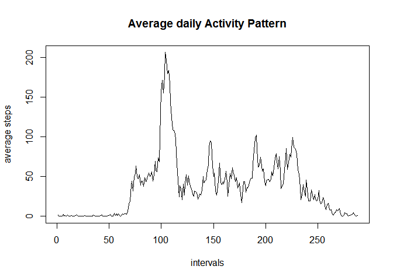
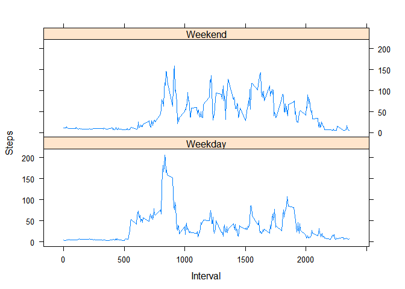

# Reproducible Research: Peer Assessment 1


## Loading and preprocessing the data
Data preprocessing occurs inline with the document.


```r
wd <- "C:/Users/gerson64/Desktop/Dropbox Sync/Dropbox/Coursera/reproducibleresearch/project1/repdata-data-activity"
setwd(wd)
dat <- read.csv("activity.csv" , stringsAsFactors = FALSE)
```

## What is mean total number of steps taken per day?

To compute this calculation I compute both the mean steps taken by day and then I calculate the mean of the mean.  This is then output as a simple printline.  Since the NA records typically occur for entire days, that means that some days have entirely null values, because of this na.rm is used for both mean statements.


```r
#What is mean total number of steps taken per day?
dayMeans <- aggregate( dat$steps , 
				by=list( dat$date ) ,
				FUN = mean , na.rm = TRUE )
print(paste0("The mean number of steps taken on a daily basis is :", round(mean(dayMeans$x , na.rm = TRUE ), 0) ))
```

```
## [1] "The mean number of steps taken on a daily basis is :37"
```


## What is the average daily activity pattern?
This calculation is much more straightforward because of the lack of NA statements and the requirement for just one level of aggregation. For this I simply take the mean by intervals and plot that to a chart which shows the average daily pattern. the data is already ordered sequentially so no additional processing is needed. 


```r
intervalMeans <- aggregate( dat$steps , 
				by=list( dat$interval ) ,
				FUN = mean , na.rm = TRUE )

plot(
intervalMeans$x , 
xlab = "intervals" , 
ylab = "average steps" ,
main = "Average daily Activity Pattern" ,
 type = "l"
)
```

 

## Imputing missing values
I first collect summary statistics around the steps, dates, and intervals to discover where possible null values are.  


```r
nrow( dat[is.na(dat$steps),]) #2304
```

```
## [1] 2304
```

```r
nrow( dat[is.na(dat$date),]) #0
```

```
## [1] 0
```

```r
nrow( dat[is.na(dat$interval),]) #0
```

```
## [1] 0
```


I discover that only intervals contain missing values, when I stumble upon a missing interval value I replace it with the mean for the interval. 


```r
names(intervalMeans)[1]<- "interval"	
dat[is.na(dat$steps),"steps"] <- merge( dat[is.na(dat$steps),] , intervalMeans , by  = "interval")$x
```


## Are there differences in activity patterns between weekdays and weekends?
The easiest way to study this value is to recereate the interval means calculation, also tagging whether it is a weekend or weekday.  


```r
weekday <- as.numeric(as.character( as.Date(dat$date ), format = "%w"))			
weekday <- ifelse(weekday == 0 , "Weekend" ,  ifelse(weekday == 6 , "Weekend" , "Weekday")) 

intervalMeans <- aggregate( dat$steps , 
				by=list( dat$interval , weekday ) ,
				FUN = mean , na.rm = TRUE )
names(intervalMeans)[1:2] <- c("interval","dateVal")
intervalMeans[,2] <- as.factor(intervalMeans[,2])
```

After that you can simply just create a lattice plot with the required information

```r
library(lattice)
xyplot( x ~ interval | dateVal , data = intervalMeans,
      type = 'l',
      xlab = 'Interval',
      ylab = 'Steps',
      layout = c(1,2))
```

 
